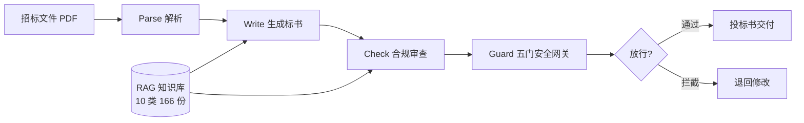

# 架构

## 总览

双模式混合架构，两模式共享同一套 Agent 函数 + MinIO 存储 + Matrix 房间界面。

| 模式 | 编排引擎 | 通信 | 人类角色 | 适用场景 |
|------|---------|------|---------|---------|
| **对话模式** | Manager（CoPaw LLM + AGENTS.md） | Matrix @mention + MinIO | 指挥者，逐阶段确认 | 关键项目、异常处理、探索 |
| **管道模式** | LangGraph StateGraph | Python 函数直调 + Matrix 进度通知 | 观察者，实时看进度 | 标准投标、批量处理、全自动 |

## 数据流



管道模式为确定性 6 节点流水线：`parse → match → write → check → export → human_review`。

```
parse_node → match_node → write_node → check_node → export_node
                                                    │
                                              human_review_node
                                              (interrupt 暂停，
                                               Matrix 审批 approve/reject/edit)
```

- 每节点执行三步：Guard 前置检查 → Agent 函数直调 → Matrix 进度通知。
- Checkpoint 持久化：节点间状态自动保存，崩溃可从断点恢复。
- HITL：只有 human_review 节点暂停等人，其余全自动。
- Matrix 通知是 fire-and-forget（best-effort 观察层），消息丢失不影响管道执行。

## 阶段细节

### Parse — 解析

招标文件 PDF → 结构化需求 + 废标模式识别。实测产出 result.md（约 9KB，15 条需求）。

### Write — 生成

按需求生成商务标 + 技术标。实测产出 bid_result.md（33KB / 677 行）。

### Check — 合规

逐条核对评分标准与废标条款（L1/L2/L3）。实测产出 compliance_check.md（189 行），识别报价内部不一致（100 万差额）、投标人信息披露缺失等问题，结论 CONDITIONAL PASS。

### Guard — 五门安全网关

每一次 Agent 工具调用先过五门，全部通过才放行（实测 5-gate inline 9/9 通过）：

| 门 | 检查内容 |
|----|----------|
| G1 白名单 | agent_id + tool_name 匹配注册白名单（硬阻断） |
| G2 动作分类 | read / draft / external_write |
| G3 风险评估 | low / medium / high |
| G4 速率限制 | 60s 滑动窗口，每 Agent 100 请求 |
| G5 HMAC 审计 | HMAC-SHA256 签名 audit.jsonl，10MB 轮转 |

Guard 是独立审计 sidecar，双模式两种形态：对话模式跑独立容器（`:8104`），管道模式在 graph.py 内联 Python 调用（无网络暴露面）。白名单：

| Agent | 允许工具 |
|-------|----------|
| bidforge-parse | parse_bidding_pdf |
| bidforge-write | generate_full_bid, fill_business_section, generate_technical_section |
| bidforge-check | check_compliance |
| bidforge-guard | check_tool_access, get_guard_status |

## 模型接入

5 个 Agent（Manager / Parse / Write / Check / Guard）经 LiteLLM 直连 DeepSeek V4 Pro，不绕中间网关。DeepSeek reasoning 模型实测 max_tokens 4096 被推理链占满导致内容截断，提至 16384。

## 组件清单

| 组件 | 运行时 | 端口 |
|------|--------|------|
| Manager | CoPaw | — |
| Parse Worker | CoPaw + FastMCP | 8101 |
| Write Worker | CoPaw + FastMCP | 8102 |
| Check Worker | CoPaw + FastMCP | 8103 |
| Guard | CoPaw + FastMCP / Python 内联 | 8104 / 内联 |
| LangGraph Orchestrator | Python 进程 | — |
| Tuwunel Matrix | Docker | 18080 |
| MinIO | Docker | 9000 |
| Element Web | Docker | 18088 |

## 质量门禁

- 386 tests 全绿
- ruff = 0 / mypy = 0
