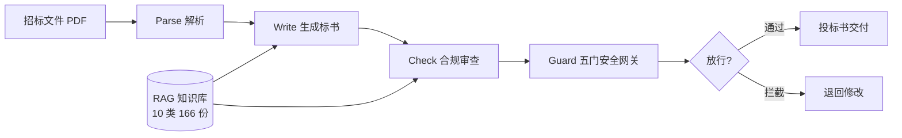

# 架构

## 总览

混合架构:

- **对话模式** — Manager 调度,交互式处理单份标书
- **管道模式** — LangGraph 确定性执行,批量跑标书

## 数据流

## 阶段细节

### Parse — 解析

招标文件 PDF → 结构化需求。实测产出 result.md(约 9KB)。

### Write — 生成

按需求生成投标书。实测产出 bid_result.md(33KB / 677 行)。

### Check — 合规

逐条核对评分标准与废标条款。实测产出 compliance_check.md(189 行),能识别报价内部不一致、披露缺失等问题。

### Guard — 安全门

5 gate inline 校验,9/9 通过。拦截不合规输出,防止废标。

## 模型接入

5 个 Agent 直连 DeepSeek,不经中转。

## 质量门禁

- 386 tests 全绿
- ruff = 0 / mypy = 0
